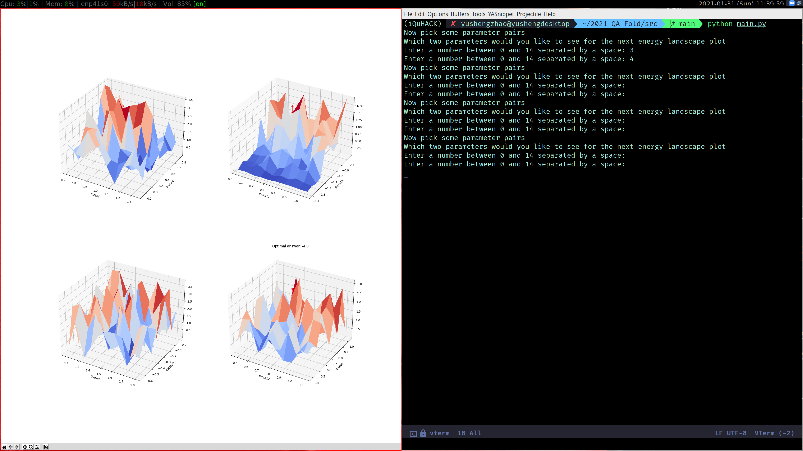

# Project: Knapsack problem solved with Gate-based Game-like VQE and Annealing-based DQM.

Team: Hybrid Demons (Advanced Hybrid Division)
Ziwei Qiu, Ilan Mitnikov, Yusheng Zhao, Nakul Aggarwal , Victor Onofre 

To represent the effect of any decision by numerical values, the outcome of the decision can be measured by a single value representing gain, profit, loss, cost, or another data category. The comparison of these values gives a total order on the set of all options for a decision. Finding the option with the highest or lowest value can be difficult because the set of available options may be extensive or not explicitly known. The knapsack problem is one of this decision process.

The knapsack problem can be formally defined as follows: We are given an item set N, consisting of n items j with profit Pj and weight Wj, and the capacity value c. The objective is to select a subset of N such that the total profit of the selected items is maximized and the total weight does not exceed c. (see more details here: https://en.wikipedia.org/wiki/Knapsack_problem)

In this project, we work on solving the Knapsack problem with both gate-based game running on IonQ hardware and annealing-based DQM/BQM methods running on D-Wave hardware, and to compare between the two methods. We further show using the DQM solver to implement the bounded Knapsack problem, and also making an optimization game with the IonQ hardware.

## Annealing: Implement the bounded Knapsack problem with the DQM solver
We demonstrated solving the Bounded Knapsack Problem with the D-wave Ocean Discrete Quadratic Model (DQM) solver, where we are allowed to take multiple pieces for each item so the variable can take discrete values 0,1,2,... up to b. This extended Knapsack problem has a direct application in stock portofolio optimization where we show a proof-of-concept demonstration in the notebook 'Knapsack_DQM.ipynb'. 

Knapsack problems appear in many real-world decision-making processes, including home energy management, cognitive radio networks, resource management in software, power allocation management, relay selection in secure cooperative wireless communication, etc. 

Future works on this project include:
1. Study in more detail and quantitatively the actual quantum advantage of solving this NP-hard problem on large dataset over classical methods by running on real quantum computers. 
2. Implement different variants of the Knapsack problem, e.g. by adding more constraints, adding m knapsacks with different capacities or optimizing the Unbounded Knapsack Problem where an unlimited amount of each item is available.
3. Use Knapsack problem as a subroutine and combine it with other NP-hard problems to solve complicated tasks challenging to classical computers.
4. In the stock selection application, we can better quantify the profits instead of just using earnings as the metric, and have more realistic assumptions.

## Gate-based VQE Game

Here we designed a game with the goal of finding the solution of the knapsack problem.
As we know, different optimization problems could be solved by optimizing a VQE like ansazt circuit.
Usually the optimization of the circuit parameters is done by a classical optimization routine.
However, in our game the user can take the optimization part into their own hands.  
The solution using the annealing machine is used to evaluate how far the user is from the goal - the minimum energy point.
  
Game outline:
- The user starts from a random point in the parameter space (the parameters describe the ansatz circuit)
- Then, because we are trying to optimize a high-dimensional problem, we cannot easily visualize the entire landscape of the cost. Even if we can, it will take up huge amount of resources to try and compute a high-dimensional grid around the starting point to see the landscape of the cost around it.
- To overcome that, we show the player multiple 3D views of the surrounding cost of different pairs of parameters they choose.
- Then the challenge is, given the view of different projection of the local cost choose a step in the direction that minimizes the total cost.
- This is basically a multidimensional navigation puzzle!!!
- The user wins if they arrive within a distance from the minimal target point.
- The user will be punished if he goes to a point in the parameter space with lower cost to the place with a higher cost
- This game is inspired by the masochistic game "Getting Over It with Bennett Foddy". Hopefully, by blindly and hopelessly traversing through the high-dimensional parameter space with the help of few projections, the player will understand why a VQE is in general a hard task to accomplish.

## Comparison between DWave and ionQ

- For small dataset, DWave only requires about 10 seconds to output the optimal answer. However, for ionQ it would take much longer both for the player and classical optimization routines. That is even without the consideration of noises in the NISQ era machines.
- For large datasets, there is no guarantee that DWave will output the optimal answer. However, we have been given reasonable results from the DWave machine. While for such large datasets, it is too time consuming to evaluate the ionQ performance. 
- That is acceptable for the focus of DWave is to solve such optimization problems. While ionQ aims for a more universal sense of Qunatum Computing. In the future, we would hope to see more noise-resilient backends from ionQ thus extending what we can do on Qunatum Computers in general.

